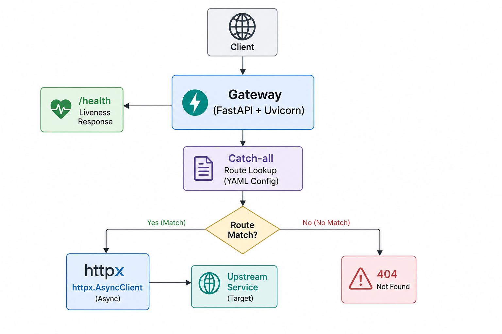

# Async API Gateway (MVP)

A minimal async API gateway / reverse proxy in Python. Routes incoming HTTP
requests to configured upstream services based on path prefixes.

## Architecture



The gateway is async end-to-end: Uvicorn runs on asyncio, FastAPI handlers
are coroutines, and outbound calls use `httpx.AsyncClient` from a single
connection-pooled client created at startup.

## Setup (local)

```bash
python -m venv .venv
source .venv/bin/activate
pip install -r requirements.txt

# Terminal 1: dummy upstream
uvicorn dummy_upstream.main:app --port 8001

# Terminal 2: gateway
GATEWAY_CONFIG=config.yaml uvicorn app.main:app --port 8000
```

(For local dev, edit `config.yaml` to point at `http://localhost:8001` instead
of `http://dummy_upstream:8000`.)

## Setup (Docker Compose)

```bash
docker compose up --build
```

Gateway is reachable at `http://localhost:8000`. Upstream is internal-only.

## Example config

```yaml
upstream_timeout_seconds: 5.0
routes:
  - prefix: /api
    upstream: http://dummy_upstream:8000
```

## Example requests

```bash
# Health
curl http://localhost:8000/health

# Proxied GET
curl http://localhost:8000/api/items/42

# Proxied POST with JSON body
curl -X POST http://localhost:8000/api/echo \
  -H "Content-Type: application/json" \
  -d '{"hello":"world"}'

# 404 for unconfigured route
curl -i http://localhost:8000/nope
```

## Tests

```bash
pytest
```

## Limitations (deliberate, for an MVP)

- **Buffers full request/response bodies** — unsuitable for large uploads,
  SSE, or websockets. Production would use streaming.
- **No authentication, rate limiting, or retries.**
- **No upstream health checks** — readiness reflects the gateway process only.
- **Static config** — changes require a restart. No hot reload.
- **No TLS termination** — assumes a separate ingress for HTTPS.
- **No distributed tracing** — only single-line structured logs.

## Future improvements

- Stream bodies via `httpx.stream()` + `StreamingResponse`.
- API key middleware (header-based, validated against config).
- Token-bucket rate limiting per API key.
- Retry with exponential backoff and jitter for idempotent methods.
- Circuit breaker per upstream to avoid hammering a failing service.
- Distributed tracing via OpenTelemetry (W3C `traceparent` propagation).
- Kubernetes manifests with liveness/readiness probes and HPA.
- Hot-reload config (watch file or pull from control plane).
